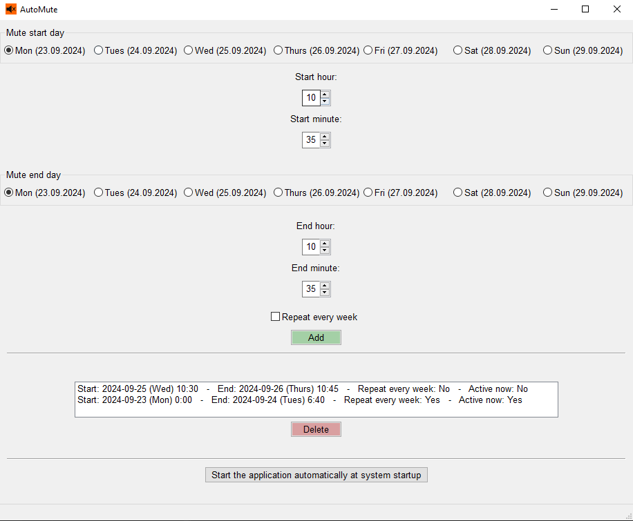

- **AutoMute** allows users to automatically mute their computer once or on a regular schedule, based on time intervals they specify.

- After you exit the app, the program will continue running in the background, which is required for muting the sound.

- The app includes an option to automatically start the program with each system startup.

- OS: Windows

---
 
[**Download installer**](https://github.com/AleksanderWojsz/AutoMute/releases/download/v1.0.0/AutoMuteInstaller.msi)

---

Screenshot: 

