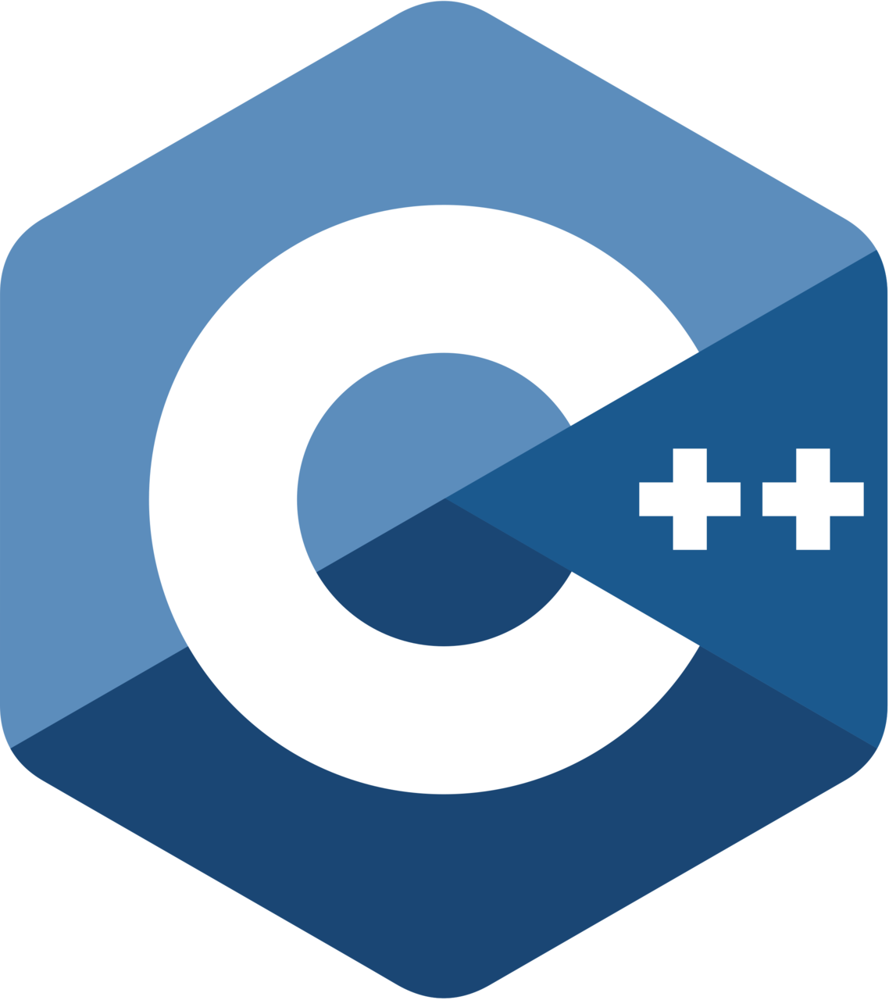
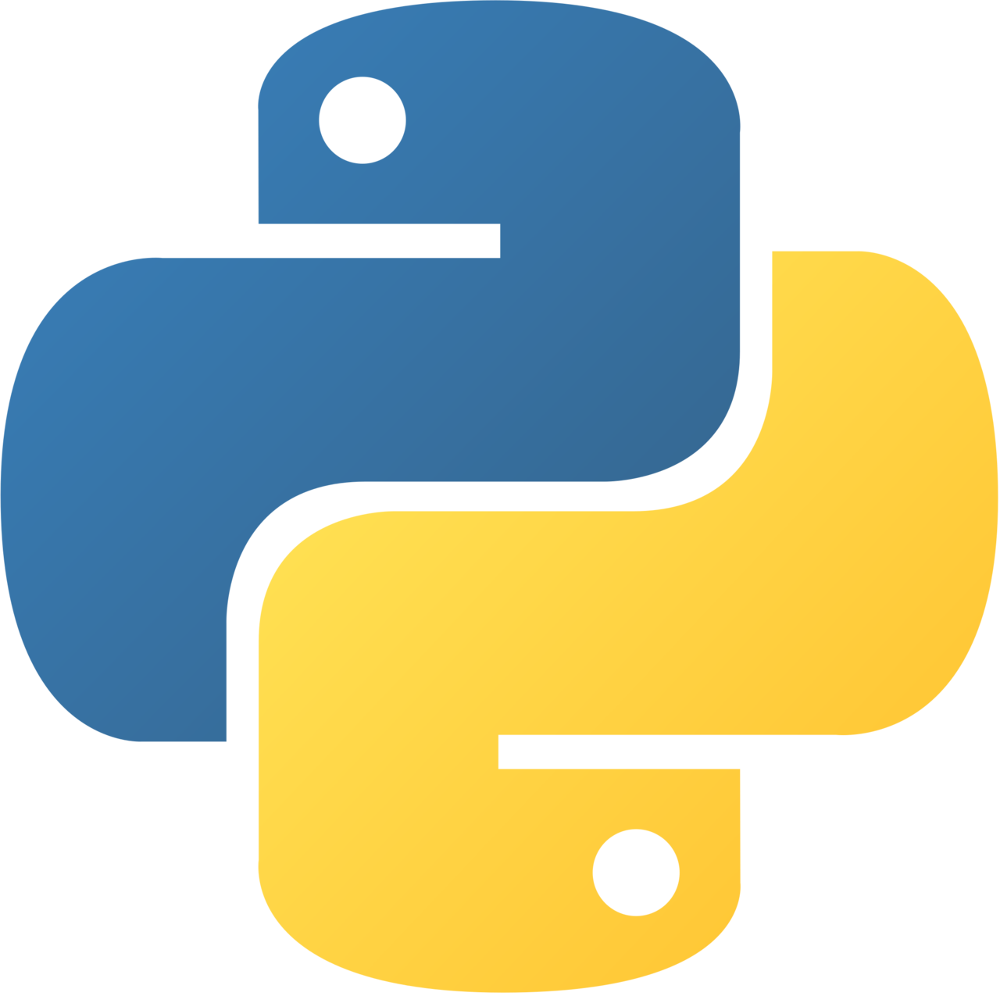
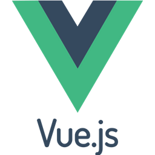

<h2> Some projects I have done </h2>

| First year at university                                                                                                                                                            |                                                                                                                                                                 |
|-------------------------------------------------------------------------------------------------------------------------------------------------------------------------------------|-----------------------------------------------------------------------------------------------------------------------------------------------------------------|
| <a href="https://github.com/AleksanderWojsz/Finished_Projects/tree/master/Computer_Architecture_and_Operating_Systems" target="_blank">Computer Architecture and OS</a>  |   |
| <a href="https://github.com/AleksanderWojsz/Finished_Projects/tree/master/Introduction_to_programming/Task_3" target="_blank">Introduction to Programming</a>                          |                                                                                   |
| <a href="https://github.com/AleksanderWojsz/Finished_Projects/tree/master/Object_Oriented_Programming" target="_blank">OOP</a>                                                  |                                                                                |

| Second year at university                                                                                                                                                  |                                                                                                                                                                                                                                                                                                                                                                                                                         |
|----------------------------------------------------------------------------------------------------------------------------------------------------------------------------|-------------------------------------------------------------------------------------------------------------------------------------------------------------------------------------------------------------------------------------------------------------------------------------------------------------------------------------------------------------------------------------------------------------------------|
| <a href="https://github.com/AleksanderWojsz/Finished_Projects/tree/master/Algorithms_and_data_structures" target="_blank">Algorithms and data structures</a>         |                                                                                                                                                                                                                                                                                                                                         |
| <a href="https://github.com/AleksanderWojsz/Finished_Projects/tree/master/C%2B%2B_Programming_Course" target="_blank">C++ Programming Course</a>                       |                                                                                                                                                                                                                                                                                                                                         |
| <a href="https://github.com/AleksanderWojsz/Finished_Projects/tree/master/Computer_Networks" target="_blank">Computer Networks</a>                                    |                                                                                                                                                                                                                                                           |
| <a href="https://github.com/AleksanderWojsz/Finished_Projects/tree/master/Concurrent_programming" target="_blank">Concurrent Programming</a>                          |                                                                                                                                                                                                                                                          |
| <a href="https://github.com/AleksanderWojsz/Finished_Projects/tree/master/Databases" target="_blank">Databases</a>                                                      |                                                                                                                                                                                                                                                                                                                                  |
| <a href="https://github.com/AleksanderWojsz/Finished_Projects/tree/master/Introduction_to_Machine_Learning" target="_blank">Introduction to Machine Learning</a>  |                                                                                                                                                                                                                                                                                                                                          |
| <a href="https://github.com/AleksanderWojsz/Finished_Projects/tree/master/Web_Applications" target="_blank">Web Applications</a>                                         |      |

| Personal Projects                                                                                                                                              |                                                                                                                                                                                                                                                                                                                                              |
|----------------------------------------------------------------------------------------------------------------------------------------------------------------|----------------------------------------------------------------------------------------------------------------------------------------------------------------------------------------------------------------------------------------------------------------------------------------------------------------------------------------------|
| <a href="https://github.com/AleksanderWojsz/Finished_Projects/tree/master/Personal_Projects/Homepage" target="_blank">Homepage</a>                             |                                                                                                                                                                         |
| <a href="https://github.com/AleksanderWojsz/Finished_Projects/tree/master/Personal_Projects/Organiser" target="_blank">Organiser Website/App</a>               |      |
| <a href="https://github.com/AleksanderWojsz/Finished_Projects/tree/master/Personal_Projects/Reinforcement_Learning" target="_blank">Reinforcement Learning</a> |                                                                                                                                                                        |
| <a href="https://github.com/AleksanderWojsz/Finished_Projects/tree/master/Personal_Projects/AutoMute" target="_blank">AutoMute</a>                             |                                                                                                                                                                                                                                                              |
